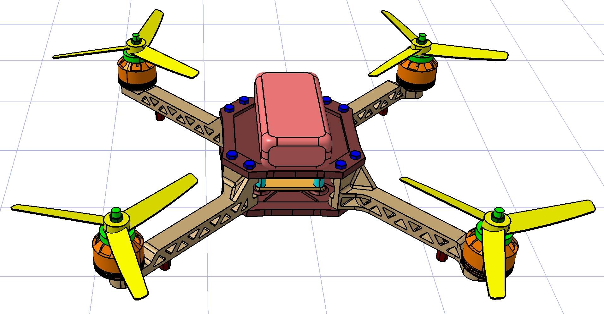

KAZZAR prototype is a lightweight single-propeller RC drone prototype designed and assembled using off-the-shelf electronic components. The project focuses on understanding propulsion systems, power distribution, flight stability, and real-time FPV (First Person View) transmission.Project Objectives

Design and assemble a functional single-motor drone system

Implement stable thrust and control mechanisms:

Integrate an FPV video transmission system

Capture aerial footage using an onboard action camera

Document the system architecture professionally

System Architecture:

The drone operates using a brushless DC motor powered by a 3S LiPo battery. Motor speed is regulated through an Electronic Speed Controller (ESC), which receives throttle signals from the RC receiver.

The FPV system operates independently, transmitting live analog video from the onboard FPV camera via a 5.8GHz transmitter to a mobile receiver device.

The action camera is used for high-resolution video recording, separate from the live FPV feed.

Below is the full 3D render of the drone assembly:

The system wiring is based on direct component integration (no custom PCB used).

Power Flow:

LiPo Battery → ESC

ESC → Brushless Motor

Control Signal Flow:

RC Receiver → ESC (Throttle Signal)

RC Receiver → Servos (Control Surfaces)

FPV System:

LiPo Battery → Voltage Regulator

Regulator → FPV Camera

Camera → 5.8GHz Video Transmitter

Transmitter → Mobile Receiver (via OTG)

A wiring diagram is included in this repository.

Key Components

Brushless Motor

Electronic Speed Controller (ESC)

3S 2200mAh LiPo Battery

RC Transmitter & Receiver

Servo Motors

FPV Camera (600–700TVL)

5.8GHz Video Transmitter

Android OTG 5.8GHz Receiver

4K Action Camera

Technical Focus Areas

Power-to-weight optimization

Voltage regulation for auxiliary systems

Vibration isolation for video stability

Proper signal routing and interference reduction

Safe LiPo battery handling

Future Improvements

Custom Power Distribution PCB

Flight controller integration

Telemetry system

Improved aerodynamic frame design

Digital FPV upgrade
